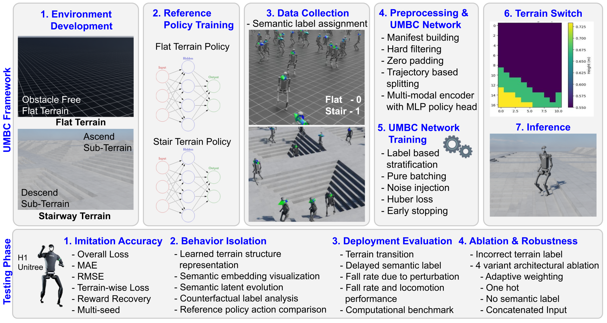

# A Semantic-Conditioned Multi-Modal Behavior Cloning Framework for Terrain-Specific Behavior Isolation in Humanoid Locomotion

[](https://doi.org/10.5281/zenodo.22844992)

<p align="center">
  
</p>

Official repository for the research paper: **"A Semantic-Conditioned Multi-Modal Behavior Cloning Framework for Terrain-Specific Behavior Isolation in Humanoid Locomotion"**.

This repository provides complete implementations for **expert trajectory collection**, **unified policy training**, **offline evaluation**, **closed-loop simulation in NVIDIA Isaac Lab**, and **paper figure/table reproduction** for the Unitree H1 humanoid robot.

---

## Table of Contents

- [Overview](#overview)
- [Repository Structure](#repository-structure)
- [System Requirements & Compatibility](#system-requirements--compatibility)
- [Installation & Environment Setup](#installation--environment-setup)
- [Dataset Preparation](#dataset-preparation)
  - [Option A: Download Pre-Collected Dataset (Recommended)](#option-a-download-pre-collected-dataset-recommended)
  - [Option B: Collect Trajectory Demonstrations from Scratch](#option-b-collect-trajectory-demonstrations-from-scratch)
  - [Dataset Statistics](#dataset-statistics)
- [Policy Training (`2.train`)](#policy-training-2train)
  - [Train the Proposed UMBC Policy](#train-the-proposed-umbc-policy)
  - [Multi-Seed Benchmark Training](#multi-seed-benchmark-training)
  - [Train Baseline Architectures](#train-baseline-architectures)
- [Policy Testing & Evaluation (`3.test`)](#policy-testing--evaluation-3test)
  - [1. Offline Testset Evaluation](#1-offline-testset-evaluation)
  - [2. Closed-Loop Simulation in Isaac Lab](#2-closed-loop-simulation-in-isaac-lab)
  - [3. Ablation Studies (Incorrect Terrain Label)](#3-ablation-studies-incorrect-terrain-label)
  - [4. External Perturbation (Push Recovery)](#4-external-perturbation-push-recovery)
  - [5. Semantic Delay (Transition Latency)](#5-semantic-delay-transition-latency)
- [Reproducing Paper Figures & Tables (`4.plot`)](#reproducing-paper-figures--tables-4plot)
  - [Generating Tables](#generating-tables)
  - [Generating Figures](#generating-figures)
- [Pretrained Checkpoints](#pretrained-checkpoints)
- [Citation](#citation)

---

## Overview

Deploying humanoid robots across disparate terrains (such as flat ground and stairways) often requires separate specialized policies or suffers from negative transfer and policy degradation when merged naively. 

**UMBC (Unified Multi-modal Behavior Cloning)** addresses this challenge by introducing an architecture that explicitly isolates and coordinates multi-modal sensory inputs:
- **Proprioception** (69 dimensions): Base velocities, orientation, joint positions, and joint velocities.
- **Perception / Elevation Scan** (187 dimensions): $11 \times 17$ local heightmap grid scanned around the robot.
- **Terrain Conditioning** (8 dimensions): Low-dimensional learnable embedding distinguishing terrain contexts.
- **Joint Action Output** (19 dimensions): Target positions for all 19 degrees of freedom (DoF) on the Unitree H1 humanoid robot.

```text
                  ┌───────────────────────┐
Proprioception ──►│ Proprioception Net    │──► (128-d) ┐
  (69-dim)        │ (69 -> 256 -> 128)    │            │
                  └───────────────────────┘            │
                                                       │
                  ┌───────────────────────┐            ▼
Perception     ──►│ Perception Net        │──► (64-d) ─┼──► Fused Representation (200-d)
  (187-dim)       │ (187 -> 128 -> 64)    │            │     │
                  └───────────────────────┘            │     ▼
                                                       │  ┌──────────────────────┐
                  ┌───────────────────────┐            │  │ Final Action Head    │──► Joint Actions
Terrain Label  ──►│ Terrain Embedding     │──► (8-d) ──┘  │ (200 -> 128 -> 19)   │      (19-DoF)
  (Categorical)   │ (Num Terrains -> 8)   │               └──────────────────────┘
                  └───────────────────────┘
```

---

## Repository Structure

```text
UMBC/
├── 1.data_collection/              # Expert trajectory demonstration collection
│   ├── flat/
│   │   ├── phase1.py               # Collects flat ground training trajectories (2,000 trajs)
│   │   └── test.py                 # Collects flat ground test trajectories (300 trajs)
│   └── stairway/
│       ├── phase1.py               # Collects stairway training trajectories (2,000 trajs)
│       └── test.py                 # Collects stairway test trajectories (300 trajs)
│
├── 2.train/                        # Model training scripts
│   ├── umbc.py                     # Proposed UMBC training pipeline (primary script)
│   ├── umbc_seed.py                # Multi-seed benchmark training (seeds: 42, 123, 456, 789, 999)
│   ├── 1hot.py                     # Baseline: One-hot encoded terrain conditioning
│   ├── adaptive_weight.py          # Baseline: Dynamic loss weighting across modalities
│   ├── concat.py                   # Baseline: Direct input feature concatenation
│   └── nolabel.py                  # Baseline: Unconditioned policy (no terrain label)
│
├── 3.test/                         # Evaluation and Isaac Lab testing
│   ├── testset_evaluation.py       # Offline evaluation on held-out test datasets
│   ├── flat_policy_comparison.py   # Closed-loop simulation evaluation on flat terrain
│   ├── stairway_policy_comparison.py # Closed-loop simulation evaluation on stairway terrain
│   ├── Ablation - Incorrect Label/ # Counterfactual terrain label ablation experiments
│   │   ├── umbc_flat_ablation.py
│   │   └── umbc_stairway_ablation.py
│   ├── Perturbation/               # Robustness under external lateral push forces
│   │   ├── umbc_flat_perturbation.py
│   │   ├── umbc_stairway_perturbation.py
│   │   ├── expert_flat_perturbation.py
│   │   └── expert_stairway_perturbation.py
│   └── Semantic_Delay/             # Terrain transition latency experiments
│       ├── umbc_transition_delayed_f2s_ascend.py
│       ├── umbc_transition_delayed_f2s_descend.py
│       ├── expert_transition_delayed_f2s.py
│       └── expert_transition_delayed_f2s_descend.py
│
├── 4.plot/                         # Paper tables and figure generation
│   ├── Figures/                    # Plotting scripts for paper figures (Figs 3-13)
│   │   ├── training_metrics.py     # Figs 3 & 4: Loss, MAE, Action RMSE
│   │   ├── reward_plot.py          # Figs 5 & 6: Reward decompositions
│   │   ├── tsne_test.py            # Fig 7: t-SNE latent space projection
│   │   ├── terrain_embedding.py    # Fig 8: Learned terrain embedding weights
│   │   ├── terrain_embedding_progress.py # Fig 9: Epoch-wise embedding evolution
│   │   ├── l2_swap.py              # Figs 10 & 11: Counterfactual L2 distance & joint swaps
│   │   └── l2_compare.py           # Figs 12 & 13: Action distance distribution to expert
│   └── Tables/                     # Paper table calculation scripts
│       ├── dataset_size.py         # Table 3: Dataset statistics
│       ├── counterfactual_l2.py    # Table 6: Counterfactual L2 prediction statistics
│       └── computation_calculation.py # Parameter count reduction analysis
│
├── utils/                          # Shared data loading and neural network definitions
│   ├── data_loader.py              # Manifest indexing and trajectory batch loading
│   └── models.py                   # PyTorch LocomotionPolicy module definition
│
├── dataset/                        # Trajectory data directory (downloaded or collected)
│   ├── flat/                       # Flat terrain training trajectories + manifest.csv
│   ├── stairway/                   # Stairway terrain training trajectories + manifest.csv
│   └── test/                       # Held-out test trajectories (flat/ and stairway/)
│
├── logs/                           # Artifacts, models, metrics, and execution logs
│   ├── models/                     # Saved model checkpoints (.pth, .pt) & JSON mappings
│   ├── metrics/                    # Pickled evaluation and training history logs (.pkl)
│   └── console/                    # Historical training, testing, and ablation logs
│
├── requirements.txt                # Complete Python dependency freeze
└── README.md
```

---

## System Requirements & Compatibility

| Component | Specification |
| :--- | :--- |
| **Operating System** | Ubuntu 20.04 / 22.04 LTS (x86_64) |
| **GPU** | NVIDIA GPU with CUDA capability $\ge$ 8.0 (RTX 3080/4080/4090, A100, etc.) |
| **NVIDIA Driver** | $\ge$ 535.129.03 |
| **NVIDIA Isaac Sim** | **4.5.0.0** |
| **NVIDIA Isaac Lab** | **2.0.2** |
| **Python** | Python 3.10 (managed through Isaac Lab environment) |
| **Robot Model** | Unitree H1 Full-Size Humanoid (19 DoF) |

> [!IMPORTANT]
> The scripts in this codebase assume the relative import and file path convention `scripts/UMBC/...`, which corresponds to placing this repository inside the Isaac Lab `scripts/` directory.

---

## Installation & Environment Setup

### 1. Install NVIDIA Isaac Sim & Isaac Lab 2.0.2

Follow the official [NVIDIA Isaac Lab Installation Guide](https://isaac-sim.github.io/IsaacLab/main/source/setup/installation/index.html) to install **Isaac Sim 4.5.0** and **Isaac Lab 2.0.2**:

```bash
# Clone Isaac Lab v2.0.2
git clone --branch v2.0.2 https://github.com/isaac-sim/IsaacLab.git
cd IsaacLab

# Run the automated installation script
./isaaclab.sh --install
```

Verify the installation runs cleanly:
```bash
./isaaclab.sh -p source/standalone/tutorials/00_sim/create_empty.py
```

### 2. Clone This Repository into Isaac Lab

Clone the `UMBC` repository inside `IsaacLab/scripts/`:

```bash
cd path/to/IsaacLab/scripts/
git clone https://github.com/fxrarz/UMBC.git
```

Alternatively, if you cloned this repository in a separate location, navigate to your repository root and create a convenience symlink:

```bash
cd path/to/UMBC
mkdir -p scripts && ln -s .. scripts/UMBC
```

### 3. Install Python Dependencies

If running outside the `./isaaclab.sh` wrapper (e.g., using a standalone virtual environment for offline model training or plotting):

```bash
# Create and activate a Python 3.10 environment
conda create -n umbc python=3.10 -y
conda activate umbc

# Install dependencies
pip install -r requirements.txt
```

---

## Dataset Preparation

The training and evaluation pipelines require trajectory demonstration datasets stored under `scripts/UMBC/dataset/`.

### Option A: Download Pre-Collected Dataset (Recommended)

To bypass running hours of simulation data collection, download the pre-generated UMBC trajectory dataset from Kaggle:

[](https://www.kaggle.com/datasets/towhitebot/umbc-dataset)

**Link:** [https://www.kaggle.com/datasets/towhitebot/umbc-dataset](https://www.kaggle.com/datasets/towhitebot/umbc-dataset)

1. Download and extract the dataset archive into `scripts/UMBC/dataset/`.
2. Ensure the resulting structure matches:

```text
scripts/UMBC/dataset/
├── flat/
│   ├── manifest.csv
│   ├── obs_env00_traj000.csv
│   └── action_env00_traj000.csv
├── stairway/
│   ├── manifest.csv
│   ├── obs_env000_traj000.csv
│   └── action_env000_traj000.csv
└── test/
    ├── flat/
    │   ├── manifest.csv
    │   └── ...
    └── stairway/
        ├── manifest.csv
        └── ...
```

Each trajectory consists of an `obs_*.csv` file containing 256 state columns and an `action_*.csv` file containing 19 motor joint command columns, tracked with a metadata `manifest.csv`.

---

### Option B: Collect Trajectory Demonstrations from Scratch

You can generate demonstration trajectories using the trained Deep Reinforcement Learning (DRL) expert policies included in `logs/models/`:
- Flat expert checkpoint: `logs/models/drl_flat.pt`
- Stairway expert checkpoint: `logs/models/drl_stairway.pt`

Run the following commands from your **root `IsaacLab` directory**:

#### 1. Collect Flat Terrain Training Demonstrations (2,000 trajectories):
```bash
./isaaclab.sh -p scripts/UMBC/1.data_collection/flat/phase1.py --headless
```
*Saves trajectories and `manifest.csv` to `scripts/UMBC/dataset/flat/`.*

#### 2. Collect Stairway Terrain Training Demonstrations (2,000 trajectories):
```bash
./isaaclab.sh -p scripts/UMBC/1.data_collection/stairway/phase1.py --headless
```
*Saves trajectories and `manifest.csv` to `scripts/UMBC/dataset/stairway/`.*

#### 3. Collect Held-Out Test Datasets (300 trajectories each):
```bash
# Collect flat terrain test set
./isaaclab.sh -p scripts/UMBC/1.data_collection/flat/test.py --headless

# Collect stairway terrain test set
./isaaclab.sh -p scripts/UMBC/1.data_collection/stairway/test.py --headless
```

---

### Dataset Statistics

Verify your dataset integrity and display Table 3 statistics (total trajectories, steps, and observation/action standard deviations):

```bash
# Training set summary
python3 scripts/UMBC/4.plot/Tables/dataset_size.py --type train

# Test set summary
python3 scripts/UMBC/4.plot/Tables/dataset_size.py --type test
```

---

## Policy Training (`2.train`)

All training scripts support standard Python execution (e.g., in your Conda environment) or through `./isaaclab.sh -p`.

### Train the Proposed UMBC Policy

To train the unified multi-modal behavior cloning policy using grouped batch sampling:

```bash
python3 scripts/UMBC/2.train/umbc.py
```

**Training Configuration:**
- **Optimizer:** AdamW (Learning Rate: $3.39 \times 10^{-3}$, Weight Decay: $2.66 \times 10^{-3}$)
- **Batch Size:** 128 (stratified grouped batch sampling across terrains)
- **Loss Function:** Huber Loss ($\delta=1.0$)
- **Scheduler:** `ReduceLROnPlateau` (factor: 0.5, patience: 5)
- **Early Stopping:** Patience of 8 epochs based on validation loss
- **Noise Injection:** Gaussian noise ($\sigma = 0.02$) applied to non-flat elevation heightmaps

**Outputs:**
- Model weights: `scripts/UMBC/logs/models/umbc.pth`
- Terrain index mapping: `scripts/UMBC/logs/models/terrain_mapping.json`
- Training history log: `scripts/UMBC/logs/metrics/umbc_history.pkl`

---

### Multi-Seed Benchmark Training

To replicate the paper's multi-seed experiments across 5 random seeds (42, 123, 456, 789, 999) and report aggregated Mean $\pm$ Standard Deviation:

```bash
python3 scripts/UMBC/2.train/umbc_seed.py
```

**Outputs:**
- Checkpoints: `scripts/UMBC/logs/models/umbc_seed_<seed>.pth`
- History logs: `scripts/UMBC/logs/metrics/umbc_seed_<seed>_history.pkl`
- Formatted summary table printed to console with $\text{Loss}$, $\text{MAE}$, and $\text{RMSE}$.

---

### Train Baseline Architectures

For comparative benchmarking, train the alternative architectures evaluated in the paper:

```bash
# 1. No-Label Baseline (no terrain conditioning)
python3 scripts/UMBC/2.train/nolabel.py

# 2. One-Hot Baseline (one-hot vector concatenation)
python3 scripts/UMBC/2.train/1hot.py

# 3. Direct Feature Concat Baseline (raw feature concatenation)
python3 scripts/UMBC/2.train/concat.py

# 4. Adaptive Weighting Baseline (dynamic task loss balancing)
python3 scripts/UMBC/2.train/adaptive_weight.py
```

All trained weights and corresponding training histories are saved under `scripts/UMBC/logs/models/` and `scripts/UMBC/logs/metrics/`.

---

## Policy Testing & Evaluation (`3.test`)

Evaluation covers offline test set metrics, closed-loop interactive simulation in Isaac Lab, counterfactual label ablations, external force perturbations, and semantic delay transitions.

### 1. Offline Testset Evaluation

Evaluate all trained policies (`umbc`, seed variants, `adaptive_weight`, `1hot`, `nolabel`, `concat`) on the held-out test datasets:

```bash
python3 scripts/UMBC/3.test/testset_evaluation.py
```

This prints overall and per-terrain Root Mean Square Error (RMSE) and Mean Absolute Error (MAE) across all 19 joints.

---

### 2. Closed-Loop Simulation in Isaac Lab

Test policies inside the NVIDIA Isaac Lab environment with real-time physics and third-person camera tracking.

#### Flat Terrain Evaluation

```bash
./isaaclab.sh -p scripts/UMBC/3.test/flat_policy_comparison.py --policy_type umbc
```

Supported `--policy_type` options:
- `umbc` *(default — proposed method)*
- `expert` *(RL expert baseline `drl_flat.pt`)*
- `adaptive_weight`
- `concat`
- `one_hot`
- `no_label`

*For headless execution (e.g., on remote servers), append `--headless`.*

#### Stairway Terrain Evaluation

```bash
./isaaclab.sh -p scripts/UMBC/3.test/stairway_policy_comparison.py --policy_type umbc
```

**Interactive Controls (GUI Mode):**
| Key | Action |
| :--- | :--- |
| `UP` | Forward velocity command ($1.0\text{ m/s}$) |
| `DOWN` | Stop base velocity ($0.0\text{ m/s}$) |
| `LEFT` | Turn left |
| `RIGHT` | Turn right |

Evaluation statistics and reward breakdowns are automatically saved to `scripts/UMBC/logs/metrics/test_<terrain>_<policy_type>_policy.pkl`.

---

### 3. Ablation Studies (Incorrect Terrain Label)

Test whether the UMBC policy has genuinely learned behavior isolation by feeding counterfactual/mismatched terrain IDs in simulation:

```bash
# Test UMBC on flat terrain with correct label (flat = 0)
./isaaclab.sh -p scripts/UMBC/3.test/Ablation\ -\ Incorrect\ Label/umbc_flat_ablation.py

# Test UMBC on flat terrain with wrong label (stairway = 1)
./isaaclab.sh -p scripts/UMBC/3.test/Ablation\ -\ Incorrect\ Label/umbc_flat_ablation.py --terrain_id 1

# Test UMBC on stairway terrain with correct label (stairway = 1)
./isaaclab.sh -p scripts/UMBC/3.test/Ablation\ -\ Incorrect\ Label/umbc_stairway_ablation.py

# Test UMBC on stairway terrain with wrong label (flat = 0)
./isaaclab.sh -p scripts/UMBC/3.test/Ablation\ -\ Incorrect\ Label/umbc_stairway_ablation.py --terrain_id 0
```

---

### 4. External Perturbation (Push Recovery)

Evaluate policy robustness by applying external impulse forces to the robot's base body:

```bash
# UMBC on flat terrain with 200 N push force
./isaaclab.sh -p scripts/UMBC/3.test/Perturbation/umbc_flat_perturbation.py --push_force 200

# UMBC on stairway terrain with 200 N push force
./isaaclab.sh -p scripts/UMBC/3.test/Perturbation/umbc_stairway_perturbation.py --push_force 200

# Expert baselines for comparison
./isaaclab.sh -p scripts/UMBC/3.test/Perturbation/expert_flat_perturbation.py --push_force 200
./isaaclab.sh -p scripts/UMBC/3.test/Perturbation/expert_stairway_perturbation.py --push_force 200
```

---

### 5. Semantic Delay (Transition Latency)

Analyze locomotion stability during flat-to-stairway transitions when semantic terrain classification experiences perceptual latency:

```bash
# Stairway ascent with 25-step delay (test with --delay 25, 50, 75, 100)
./isaaclab.sh -p scripts/UMBC/3.test/Semantic_Delay/umbc_transition_delayed_f2s_ascend.py --delay 25

# Stairway descent with 25-step delay
./isaaclab.sh -p scripts/UMBC/3.test/Semantic_Delay/umbc_transition_delayed_f2s_descend.py --delay 25
```

---

## Reproducing Paper Figures & Tables (`4.plot`)

All analysis scripts can be run directly using Python from the root directory:

### Generating Tables

| Paper Table | Script | Description |
| :--- | :--- | :--- |
| **Table 3** | `python3 scripts/UMBC/4.plot/Tables/dataset_size.py --type train` | Demonstration dataset statistics |
| **Table 6** | `python3 scripts/UMBC/4.plot/Tables/counterfactual_l2.py` | Prediction-distance $L_2$ statistics under label swapping |
| **Model Size** | `python3 scripts/UMBC/4.plot/Tables/computation_calculation.py` | Model parameter reduction comparison |

---

### Generating Figures

| Paper Figure | Script | Description |
| :--- | :--- | :--- |
| **Figures 3 & 4** | `python3 scripts/UMBC/4.plot/Figures/training_metrics.py` | Training Loss, MAE, Action RMSE, and per-terrain loss curves |
| **Figures 5 & 6** | `python3 scripts/UMBC/4.plot/Figures/reward_plot.py` | Reward decomposition comparison (Reference DRL vs. UMBC) |
| **Figure 7** | `python3 scripts/UMBC/4.plot/Figures/tsne_test.py` | t-SNE projection of the 200-d fused latent representation |
| **Figure 8** | `python3 scripts/UMBC/4.plot/Figures/terrain_embedding.py` | Visualization of the learned 8-d terrain embedding weights |
| **Figure 9** | `python3 scripts/UMBC/4.plot/Figures/terrain_embedding_progress.py` | Epoch-wise trajectory evolution of terrain embeddings |
| **Figures 10 & 11** | `python3 scripts/UMBC/4.plot/Figures/l2_swap.py` | Counterfactual label swap $L_2$ distance distribution & actions |
| **Figures 12 & 13** | `python3 scripts/UMBC/4.plot/Figures/l2_compare.py` | $L_2$ action distance to expert policies & joint trajectories |

Generated figures are saved under `scripts/UMBC/logs/images/` or displayed interactively.

---

## Pretrained Checkpoints

The repository includes pre-trained model weights in `logs/models/` for immediate evaluation without retraining:

| Checkpoint | Path | Description |
| :--- | :--- | :--- |
| **UMBC (Primary)** | `logs/models/umbc.pth` | Main proposed UMBC policy checkpoint |
| **UMBC Seed 42** | `logs/models/umbc_seed_42.pth` | Multi-seed benchmark model (Seed 42) |
| **UMBC Seed 123** | `logs/models/umbc_seed_123.pth` | Multi-seed benchmark model (Seed 123) |
| **UMBC Seed 456** | `logs/models/umbc_seed_456.pth` | Multi-seed benchmark model (Seed 456) |
| **UMBC Seed 789** | `logs/models/umbc_seed_789.pth` | Multi-seed benchmark model (Seed 789) |
| **UMBC Seed 999** | `logs/models/umbc_seed_999.pth` | Multi-seed benchmark model (Seed 999) |
| **Adaptive Weight** | `logs/models/adaptive_weight.pth` | Baseline with dynamic loss weighting |
| **One-Hot** | `logs/models/1hot.pth` | Baseline with one-hot terrain input |
| **Feature Concat** | `logs/models/concat.pth` | Baseline with concatenated raw observations |
| **No-Label** | `logs/models/nolabel.pth` | Baseline without terrain conditioning |
| **Flat RL Expert** | `logs/models/drl_flat.pt` | Pretrained DRL expert for flat ground |
| **Stairway RL Expert** | `logs/models/drl_stairway.pt` | Pretrained DRL expert for stairway terrain |
| **Terrain Mapping** | `logs/models/terrain_mapping.json` | JSON dictionary mapping terrain names to indices |

---

## Citation

If you find this work or codebase useful in your research, please cite our paper:

```bibtex
@article{umbc2026locomotion,
  title   = {UMBC: Unified Multi-modal Behavior Cloning for Humanoid Locomotion Behavior Isolation},
  author  = {Whitebot Research Team},
  journal = {arXiv preprint},
  year    = {2026}
}
```

---

## Contact & Issues

For questions, bug reports, or inquiries regarding the dataset and models, please open an issue in this repository.
